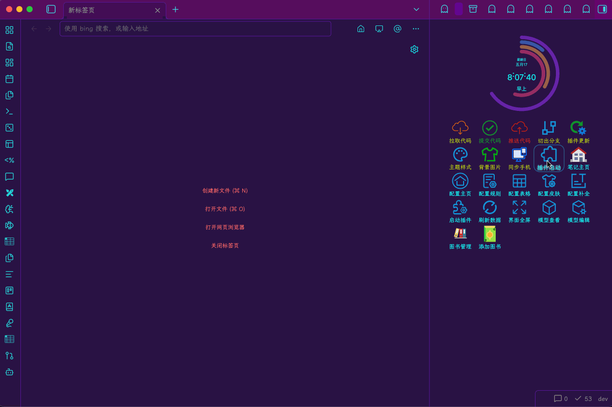
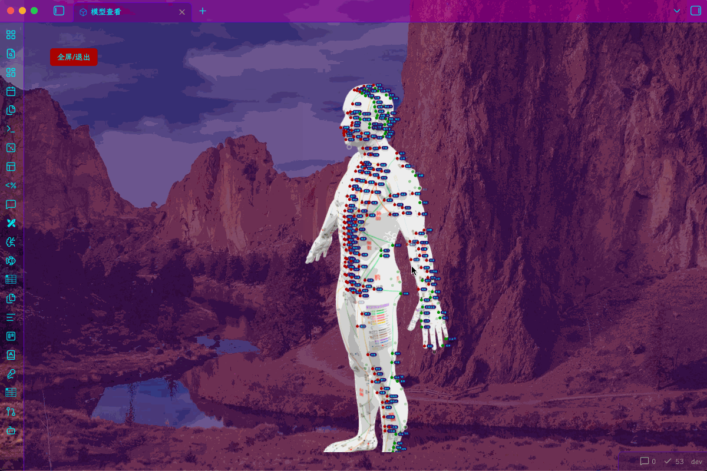

**中文** | **[English](./README_en.md)**

# Pluto Hub - 轻量化模块管理中心

Pluto Hub 是一款为提升 Obsidian 运行时性能与扩展体验而设计的局部代码模块中心。它旨在帮助非技术背景用户和开发者，在不破坏库内笔记纯净度、不拖慢系统启动速度的前提下，以高能解耦的 .ops 配置包形式，安全、直观地运行与维护本地轻量化代码扩展。

  
   
  <em>完整界面截图</em>

## 🎯 为什么开发 Pluto Hub？（致 Obsidian 社区与官方开发团队）

作为 Obsidian 的深度拥趸与独立开发者，我们注意到随着社区生态的爆发，重度知识管理用户和官方团队正共同面临以下三个难以调和的生态架构痛点：

1. “微型控件”的开发实现断层：用户常常只需要一些极其局部的轻量功能，让普通用户去配置复杂的环境并编写社区插件过于沉重；而使用 dataviewjs 或 templater 在 .md 笔记内硬嵌长篇 JavaScript 渲染代码，又会导致笔记内容与展现逻辑严重割裂，普通人很难维护。

2. 重度依赖引发的启动性能死穴（Startup Time Penalty）：为了堆砌主页（Dashboard）的各种组件，用户通常需要同时启用 20~40 个不同的社区插件。这导致 Obsidian 初始运行时面临严重的卡顿和白屏延迟。官方目前缺乏一套优雅的、针对“非刚需视觉组件”的按需延迟激活（Lazy Loading）标准机制。

3. 多端同步配置的噩梦（Configuration Conflicts）：习惯使用 Git 或第三方云盘多端多设备同步（如移动端与 PC 端）的用户，经常遇到不同插件的 data.json 发生恶性代码覆盖或路径冲突，导致整个本地配置库时常报障。

Pluto Hub 正是为了填平这三个“生态灰色地带”而生的轻量化解决方案。 它不破坏现有的官方主权，而是提供了一个统一的隔离容器，让“代码归代码，内容归内容”，实现高能解耦。

## 🎨 预览功能

  
   
  <em>刷新插件效果</em>

  
   
  <em>核心功能演示</em>

## 📚 示例仓库
想查看 Pluto Hub 的实际效果？请访问示例仓库：

### 📊 Pluto Hub 核心特性与扩展机制审计 (System Features)

为了确保插件完全符合社区最严格的安全性与运行时性能（Runtime Performance）规范，Pluto Hub 采用统一的轻量化沙箱容器逻辑，核心框架对各类高级扩展模块提供底层原生支持：

| 功能特性模块 | 针对解决的社区/官方痛点 (Core Pain Points) | 本地运行机制与用户体验 | 扩展获取与交付状态 |
| :--- | :--- | :--- | :--- |
| **⏱️ 运行时生命周期控制** | 解决重度用户开启大量主页插件拖慢 Obsidian 初始加载、造成白屏延迟的性能死穴（Startup Time）。 | 提供全局控制台，支持对所有扩展组件进行 `[ 0延迟 / 2s延迟 / 4s长延迟 / 关闭 ]` 四档按需异步激活。 | 📦 **示例仓库（内置）** |
| **🎨 模块化 Grid 卡片容器** | 拒绝在普通 `.md` 笔记内硬嵌大量不伦不类的 JS 渲染代码。深度收编并完美兼容 `dataviewjs` 底层能力。 | 提供现代化的 Grid 卡片布局、拖拽排序以及批量导入导出，使展现逻辑与笔记内容彻底实现代码隔离。 | 📦 **示例仓库（内置）** |
| **🚀 配置存储拦截引擎** | 解决多设备（如移动端/PC端）使用 Git 备份时，各插件配置频繁爆发恶性冲突的同步噩梦。 | 拦截各扩展模块的配置数据进行统一归流管理。`.obsidian/plugins/` 文件夹可直接进 `.gitignore`，实现**多端同步零冲突**。 | 🌐 **内核级原生支持 (导入)** |
| **🧬 WebGL 3D 空间定位联动** | 传统 3D 轨道录制数据沉重死板，修改或微调极易触发全局坐标崩溃（Three.js官网），且无法与本地笔记深度联动。 | 在 Obsidian 本地无缝接入三维渲染沙箱，点击 3D 骨骼/肌肉/穴位，秒级唤出本地对应的双向联动笔记！ | 🌐 **WebGL引擎支持 (导入)** |
| **🎧 丰富前端微组件生态** | 包含沙箱化音乐播放器、实时时评看板、菜单命令一键下载等精致组件，满足高密度信息流中控需求。 | 支持通过标准的 `.ops` 格式进行无痛导入/导出，开发者与非技术用户无需碰任何底层编译环境。 | 🌐 **生态接口开放 (导入)** |

### 📁 多种文件类型支持

| 类型 | 扩展名 | 说明 |
|------|--------|------|
| JavaScript | `.js` | 完全沙箱安全执行 |
| CSS | `.css` | 独立控制，支持随时按需激活/关闭 |
| JSON | `.json` | 配置文件动态解析与状态热重载 |
| YAML | `.yaml` / `.yml` | 配置文件动态解析与状态热重载 |
| Markdown | `.md` | 内容沙箱隔离式纯净渲染 |
| 图片 | `.jpg` / `.gif` / `.png` | 图片处理 |
| GLB | `.glb` | 3D 空间交互模型引擎原生支持 |
| Page | `.page` | 独立微前端页面组件生态封装 |

## 安装方法

### 社区插件市场安装（推荐）

> 打开 Obsidian 设置 ->「社区插件」 -> 搜索「Pluto Hub」 -> 点击「安装」并启用。

### 手动安装（开发版调试）

> 将打包好的 main.js、styles.css、manifest.json 复制到库目录：<Vault>/.obsidian/plugins/obsidian-pluto-hub/ 路径下，重启 Obsidian 启用即可。

### 🤝 关联插件的底层生态编排

如果检测到本地激活了以下大宗官方插件，Pluto Hub 的沙箱运行时将自动将其底层内核收编，并映射出更高级的、与内容隔离的可编程接口：

1. React Components：通过 pluto.third.react 完美驱动组件状态

2. Templater：通过 pluto.third.templater 实行脚本级生命周期挂载

3. Dataview：通过 pluto.third.dva 解锁无代码化的高级数据渲染输出

### 如何使用扩展模块

Pluto Hub 支持通过导入外部模块来扩展功能。

1. 从可信来源获取模块文件（扩展名为 `.ops`）
2. 在插件设置中**自定义存储路径**（默认为 `.obsidian/cache/modules`）
3. 将 `.ops` 模块文件放入该目录
4. 返回插件界面，模块会自动加载并生效

> ⚠️ 请仅导入您信任来源的模块。本插件不对第三方模块的安全性负责，用户需自行承担风险。

## 版本历史

详细更新日志请查看 [CHANGES.md](./CHANGES.md)。

## 🙏 支持作者

如果 Pluto Hub 成功帮您精简了结构、提升了启动性能，欢迎请作者喝杯咖啡 ☕

---

### 支付宝 & 微信

<table align="center">
  <tr>
    <td align="center">
       
      <strong>支付宝</strong>
    </td>
    <td align="center">
       
      <strong>微信</strong>
    </td>
  </tr>
</table>

---

## 许可证与联系方式

License: [MIT License](./LICENSE)

Email: xiajianduan@outlook.com / xiajianduan@qq.com

GitHub Issues: [https://github.com/xiajianduan/obsidian-pluto-hub/issues](https://github.com/xiajianduan/obsidian-pluto-hub/issues)

---

**简化功能移值性，重新定义你的 Obsidian 生产力。** 🚀