**[English](./README.md)** | **中文**

# Pluto Hub - Obsidian 代码片段商城

Pluto Hub 是一款强大的 Obsidian 插件，允许用户管理、编辑和运行本地代码模块，为 Obsidian 提供了丰富的扩展能力。

[](https://github.com/xiajianduan/obsidian-pluto-hub/releases)
[](https://github.com/xiajianduan/obsidian-pluto-hub/stargazers)
[](https://github.com/xiajianduan/obsidian-pluto-hub/issues)
[](LICENSE)

## 功能特性

### 🎨 预览功能
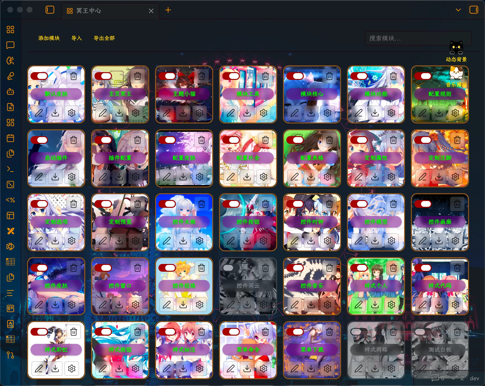

### 🛠 定制模块
|模块图标|模块名称|模块说明|模块预览|
|--|--|--|--
|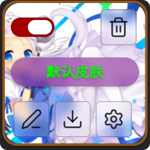|默认皮肤|`pluto.themeManager.nextTheme()`||
|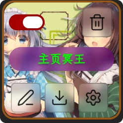|主页冥王|`right.page` `home.page`|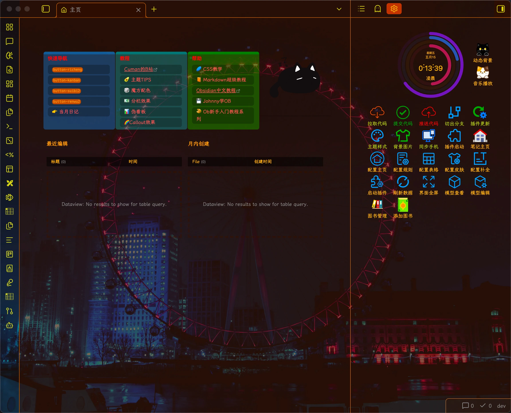|
|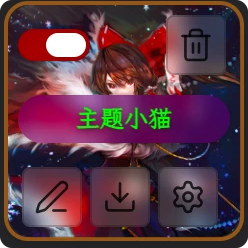|主题小猫|根据时间切换小猫，组件`jsx:<AnimationCute/>`||
|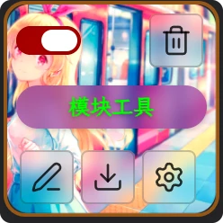|模块工具|基础工具|/|
|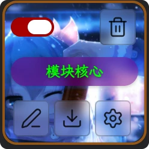|模块核心|模块核心功能|/|
|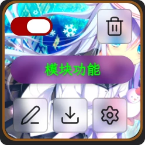|模块功能|自定义功能|/|
|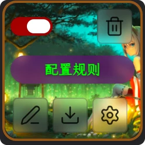|配置规则|配置规则管理|/|
|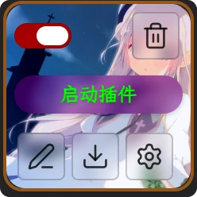|启动插件|插件|/|
|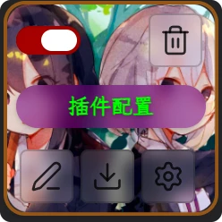|插件配置|/|/|
|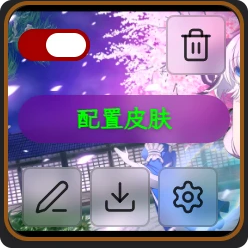|配置皮肤|/|/|
|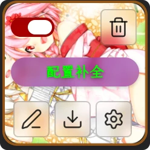|配置补全|/|/|
|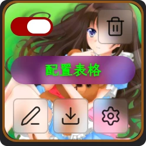|配置表格|/|/|
|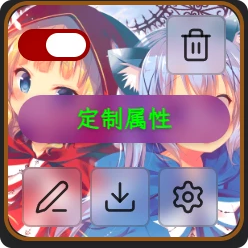|定制属性|/|/|
|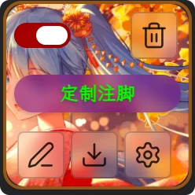|定制注脚|/|/|
|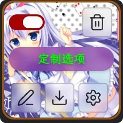|定制选项|/|/|
||定制预览|/|/|
|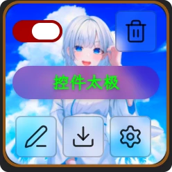|控件太极|/|/|
|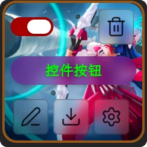|控件按钮|/|/|
|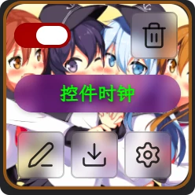|控件时钟|/|/|
|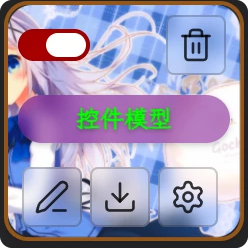|控件模型|/|/|
|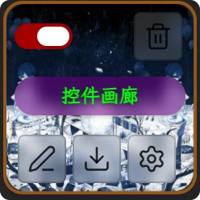|控件画廊|/|/|
|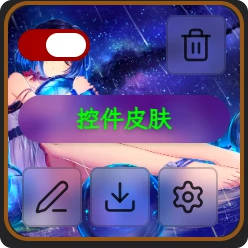|控件皮肤|/|/|
|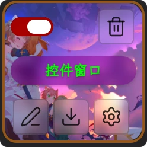|控件窗口|/|/|
||控件经络|/|/|
|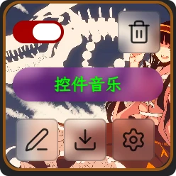|控件音乐|/|/|
|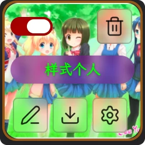|样式个人|/|/|
|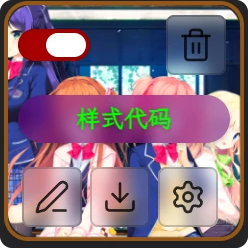|样式代码|/|/|
|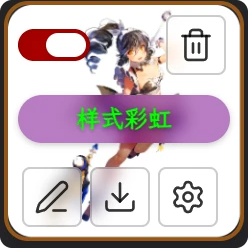|样式彩虹|/|/|
|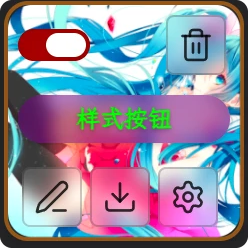|样式按钮|/|/|
|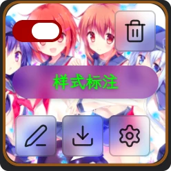|样式标注|/|/|
|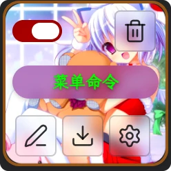|菜单命令|/|/|
|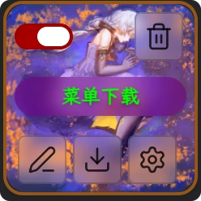|菜单下载|/|/|


### 📦 模块管理
- Grid 卡片布局：美观的模块展示界面，支持自定义主题色
- 拖拽排序：支持直观调整模块顺序
- 启用/禁用控制：灵活控制模块的运行状态
- 导入/导出功能：支持单个模块或全量模块的备份与恢复
- 批量导入导出：支持一次性导入多个文件或导出多个模块

### 💻 代码编辑器
- CodeMirror 6 集成：支持 JS、CSS、JSON、YAML、Markdown 等多种格式的语法高亮
- 多文件支持：每个模块可以包含多个文件
- 实时编辑：修改后立即生效
- Obsidian 原生样式：使用 Obsidian 官方 CSS 变量，保持视觉一致性

### 🌟 主题系统
- 多种主题支持：内置多种主题风格
- 自定义主题：支持自定义主题配置
- 主题管理器：统一管理主题设置

### 📝 动态表单
- 表单配置：支持通过 JSON 配置动态表单
- 表单字段：支持文本、下拉、复选框等多种字段类型
- 表单验证：支持必填项验证

### 🌐 全局挂载
- pluto 对象：所有模块的输出都挂载到 `window.pluto` 全局对象
- 配置管理：JSON 和 YAML 配置文件自动解析
- CSS 注入：模块中的 CSS 自动注入到文档头部

### 🤝 依赖管理
- 第三方插件集成：自动检测并映射第三方插件依赖
- 动态依赖绑定：支持 React Components、Templater、Dataview、DVA、QA 等插件的依赖管理

### 📁 多种文件类型支持

| 类型 | 扩展名 | 说明 |
|------|--------|------|
| JavaScript | `.js` | 沙箱执行，支持模块导出 |
| CSS | `.css` | 自动注入到文档头部 |
| JSON | `.json` | 配置解析 |
| YAML | `.yaml` / `.yml` | 配置解析 |
| Markdown | `.md` | 内容渲染 |
| 图片 | `.jpg` / `.gif` / `.png` | 图片处理 |
| GLB | `.glb` | 3D 模型支持 |
| Page | `.page` | 页面组件 |

## 安装方法

### 社区插件市场安装

1. 打开 Obsidian 设置
2. 进入「社区插件」
3. 搜索「Pluto Hub」
4. 点击「安装」
5. 启用插件

### 手动安装

1. 下载最新版本文件：`main.js`、`styles.css`、`manifest.json`
2. 复制到你的 Obsidian 库插件目录：`<Vault>/.obsidian/plugins/obsidian-pluto-hub/`
3. 重启 Obsidian
4. 在设置中启用插件

## 快速开始

### 创建第一个模块

1. 点击左侧边栏的 Pluto Hub 图标打开仪表盘
2. 点击「Add Module」按钮
3. 输入模块名称，如「My First Module」
4. 点击模块卡片进入编辑器
5. 在 `main.js` 中输入代码：

```javascript
return {
    hello: function() {
        console.log('Hello from Pluto Hub!');
        return 'Hello Pluto!';
    }
};
```

6. 点击「Save all changes」保存

### 使用模块

```javascript
pluto["My First Module"].hello();
// 输出 "Hello from Pluto Hub!" 并返回 "Hello Pluto!"
```

### 使用动态表单

```javascript
await pluto.formManager.openForm({
    title: "我的表单",
    fields: [
        { id: "name", type: "text", label: "姓名", required: true },
        { id: "age", type: "number", label: "年龄" },
        { id: "gender", type: "select", label: "性别", options: ["男", "女", "其他"] }
    ]
});
```

## 模块定义

### JavaScript 模块

```javascript
return {
    greet: function(name) {
        return `Hello, ${name}!`;
    },
    version: "1.0.0",
    config: {
        theme: "dark",
        fontSize: 16
    }
};
```

### CSS 模块

```css
.my-custom-class {
    color: var(--interactive-accent);
    font-weight: bold;
}

.note-card {
    background-color: var(--background-secondary);
    border-radius: var(--radius-s);
    padding: var(--size-4);
}
```

### JSON 配置

```json
{
    "apiKey": "your-api-key",
    "baseUrl": "https://api.example.com",
    "settings": {
        "autoSave": true,
        "theme": "light"
    }
}
```

### YAML 配置

```yaml
apiKey: your-api-key
baseUrl: https://api.example.com
settings:
  autoSave: true
  theme: light
```

## Pluto 对象

### 核心属性

| 属性 | 说明 |
|------|------|
| `pluto.app` | Obsidian 应用实例 |
| `pluto.self` | Pluto Hub 插件实例 |
| `pluto.coreManager` | 核心管理器，负责运行模块 |
| `pluto.viewManager` | 视图管理器 |
| `pluto.formManager` | 表单管理器 |
| `pluto.themeManager` | 主题管理器 |
| `pluto.configManager` | 配置管理器 |
| `pluto.third` | 第三方组件 |
| `pluto.images` | 图片转换器 |
| `pluto.helper` | 辅助工具函数 |

### 核心方法

- `pluto.getModule(name)` - 获取指定名称的模块
- `pluto.registerModule(name, exports)` - 注册模块
- `pluto.importJs(path)` - 动态导入 JavaScript 文件

### 第三方插件映射

| 插件 | Pluto 对象路径 |
|------|---------------|
| React Components | `pluto.third.react` |
| Templater | `pluto.third.templater` |
| Dataview | `pluto.third.dv` |
| DVA | `pluto.third.dva` |
| QA | `pluto.third.qa` |
| Simple Component | `pluto.third.simple` |

## 项目结构

```
src/
├── main.ts                # 插件主入口
├── pluto.ts               # Pluto 核心功能
├── settings.ts             # 插件设置
├── storage.ts              # 存储管理
├── core/                  # 核心模块
│   ├── BoardRenderer.ts   # 看板渲染器
│   ├── EditorRenderer.ts  # 编辑器渲染器
│   ├── ImageConverter.ts  # 图片转换器
│   ├── MirrorRenderer.ts  # 镜像渲染器
│   ├── ModuleAction.ts    # 模块操作管理器
│   ├── PluginContext.ts   # 插件上下文
│   └── ViewResolver.ts    # 视图解析器
├── manager/               # 管理器
│   ├── ConfigManager.ts   # 配置管理器
│   ├── CoreManager.ts     # 核心管理器
│   ├── FormManager.ts     # 表单管理器
│   ├── ThemeManager.ts    # 主题管理器
│   └── ViewManager.ts     # 视图管理器
├── exec/                   # 执行器
│   ├── CssExecutor.ts     # CSS 执行器
│   ├── GlbExecutor.ts     # GLB 执行器
│   ├── ImageExecutor.ts   # 图片执行器
│   ├── JsonExecutor.ts    # JSON 执行器
│   ├── MarkdownExecutor.ts # Markdown 执行器
│   ├── PageExecutor.ts    # Page 执行器
│   ├── SandboxExecutor.ts # 沙箱执行器
│   ├── SimpleExecutor.ts  # 简单执行器
│   └── YamlExecutor.ts    # YAML 执行器
├── modal/                 # 模态框组件
│   ├── FormField.tsx      # 表单字段组件
│   ├── FormJson.ts        # 表单 JSON 处理
│   ├── FormModal.tsx      # React 表单模态框
│   └── PlutoFormModal.tsx # Pluto 表单模态框
├── i18n/                  # 国际化
│   ├── en.ts              # 英文翻译
│   └── zh-cn.ts           # 中文翻译
├── third/                 # 第三方组件
│   ├── DvaComponent.ts    # DVA 组件
│   ├── QaComponent.ts     # QA 组件
│   ├── ReactComponent.ts  # React 组件
│   ├── SimpleComponent.ts # 简单组件
│   ├── TemplaterComponent.ts # Templater 组件
│   └── ThirdFactory.ts    # 第三方组件工厂
├── types/                 # TypeScript 类型定义
│   ├── form.d.ts          # 表单类型
│   ├── global.d.ts        # 全局类型
│   └── obsidian.d.ts      # Obsidian 类型
├── utils/                 # 工具函数
│   ├── array.ts           # 数组工具
│   ├── const.ts           # 常量定义
│   ├── helper.ts          # 辅助函数
│   └── translation.ts     # 翻译工具
└── view/                  # 视图组件
    ├── PlutoBoardView.ts  # 看板视图
    ├── PlutoFileView.ts   # 文件视图
    └── PlutoTextView.ts   # 文本视图
```

## 开发指南

### 环境准备

- Node.js 16+
- npm 或 yarn

### 构建流程

```bash
# 克隆仓库
git clone https://github.com/xiajianduan/obsidian-pluto-hub.git

# 安装依赖
npm install

# 开发模式
npm run dev

# 生产构建
npm run build

# 代码检查
npm run lint
```

## 高级用法

### 模块间通信

```javascript
// Module A
export const sharedData = { value: 42 };

// Module B
console.log(pluto["Module A"].sharedData.value);
pluto["Module A"].sharedData.value = 100;
```

### 动态加载资源

```javascript
// 加载外部脚本
const script = document.createElement('script');
script.src = 'https://cdn.example.com/library.js';
document.head.appendChild(script);

// 加载外部样式
const link = document.createElement('link');
link.rel = 'stylesheet';
link.href = 'https://cdn.example.com/styles.css';
document.head.appendChild(link);
```

### 使用表单

```javascript
const result = await pluto.formManager.openForm({
    title: "用户信息",
    fields: [
        { id: "username", type: "text", label: "用户名", required: true },
        { id: "email", type: "text", label: "邮箱" },
        { id: "age", type: "number", label: "年龄" },
        { id: "newsletter", type: "checkbox", label: "订阅新闻通讯" }
    ]
});

if (result) {
    console.log("用户信息:", result);
}
```

## 故障排除

### 模块无法运行
1. 检查模块是否已启用
2. 查看浏览器控制台错误信息
3. 确保代码语法正确
4. 检查第三方插件依赖是否正确安装

### 导入失败
1. 检查文件格式是否正确
2. 确保文件没有损坏
3. 查看浏览器控制台错误信息

### 性能问题
1. 禁用不需要的模块
2. 优化代码，避免长时间运行的函数
3. 减少模块数量

## 版本历史

详细更新日志请查看 [CHANGES.md](./CHANGES.md)。

## 贡献指南

欢迎提交 Issue 和 Pull Request！

## 支持作者

如果你觉得这个插件对你有帮助，可以请作者喝杯咖啡：

Support @mzs:
<a href="https://buymeacoffee.com/1553599299u" target="_blank"></a>

### 支付宝赞助


### 微信赞助


### 其他方式

- 邮箱：xiajianduan@outlook.com
- 邮箱：xiajianduan@qq.com

---

## 许可证

[0-BSD License](./LICENSE)

## 联系方式

- GitHub Issues: [https://github.com/xiajianduan/obsidian-pluto-hub/issues](https://github.com/xiajianduan/obsidian-pluto-hub/issues)

---

**享受 Pluto Hub 带来的强大扩展能力！** 🚀